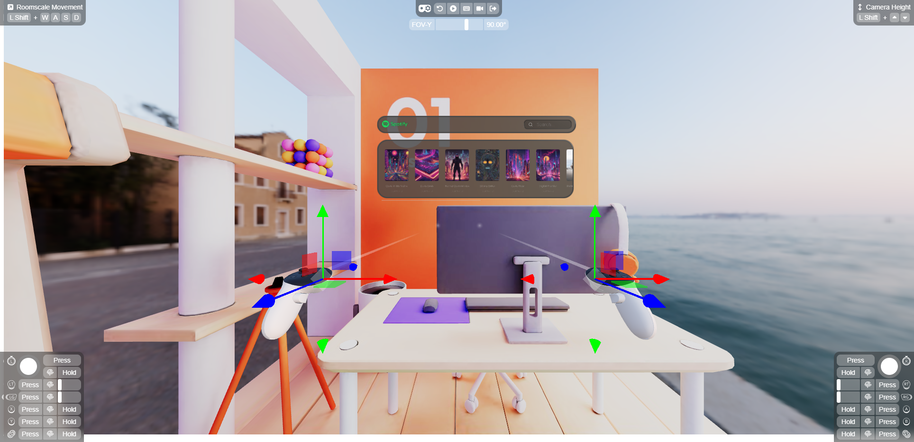

# SpatialJS Core

SpatialJS Core is a powerful library for building spatial applications for the open web. Leveraging React Three Fiber (R3F), it enables developers to create fully immersive 3D experiences. With SpatialJS, you can easily construct and manage spatial user interfaces, making it an ideal toolkit for developing next-generation web applications, VR/AR experiences, and spatial computing platforms.

<p align="center">
  
</p>

<p align="center">
  <a href="https://npmjs.com/package/@spatialjs/core" target="_blank">
    
  </a>
  <a href="https://npmjs.com/package/@spatialjs/core" target="_blank">
    
  </a>
  <a href="https://twitter.com/spatialmatty" target="_blank">
    
  </a>
  <a href="https://discord.gg/tKNwtpDVJn" target="_blank">
    
  </a>
</p>

## Amazing Projects Making SpatialJS Possible:

<div style={{ display: 'flex', justifyContent: 'center', alignItems: 'center', gap: '20px', marginBottom: '20px', flexWrap: 'wrap' }}>
  <div style={{ display: 'flex', flexDirection: 'column', alignItems: 'center', gap: '10px' }}>
    <a href="https://github.com/pmndrs/react-three-fiber" target="_blank" rel="noopener noreferrer">
      
    </a>
    <a href="https://twitter.com/0xca0a" target="_blank" rel="noopener noreferrer">
      
    </a>
  </div>
  <div style={{ display: 'flex', flexDirection: 'column', alignItems: 'center', gap: '10px' }}>
    <a href="https://github.com/pmndrs/react-xr" target="_blank" rel="noopener noreferrer">
      
    </a>
    <a href="https://twitter.com/BelaBohlender" target="_blank" rel="noopener noreferrer">
      
    </a>
  </div>
  <div style={{ display: 'flex', flexDirection: 'column', alignItems: 'center', gap: '10px' }}>
    <a href="https://github.com/pmndrs/uikit" target="_blank" rel="noopener noreferrer">
      
    </a>
    <a href="https://twitter.com/BelaBohlender" target="_blank" rel="noopener noreferrer">
      
    </a>
  </div>
</div>

## Features

- Create and manage 3D windows in a spatial environment
- Intuitive React components for building 3D UIs
- Flexible window management with tiling, focusing, and minimizing
- Support for VR/AR experiences
- Easy integration with React Three Fiber

## What does Spatialjs do?

| Simple Example for a room with a music player |  |
| --------------------------------------------- | -------------------------------------------------------- |

## Installation

Install SpatialJS Core and its peer dependencies:

```bash
npm install @spatialjs/core react @react-three/fiber three @react-three/uikit
```

## Quick Start

1. Add the WindowManager to your scene

```tsx
import { WindowManager, createWindow } from "@spatialjs/core";
<WindowManager />;
```

2. Add a Window to your scene

```tsx
import { createWindow } from "@spatialjs/core";
const window = createWindow(MusicPlayer, {
  title: "My Window",
  disableBackground: true,
});
```

## Documentation

For detailed usage instructions and API reference, please refer to our [documentation](https://www.spatialjs.dev/).

## Examples

Check out our [examples directory](https://www.spatialjs.dev/examples) for more advanced usage scenarios and demos.

## Contributing

We welcome contributions! Please see our [contributing guidelines](link_to_contributing_guidelines) for more details.

## Support

For questions, bug reports, or feature requests, please open an issue on our [GitHub repository](https://github.com/Deamoner/spatialjs).

---

Built with ❤️ by [Deamoner](https://twitter.com/spatialmatty)

Visit my personal site: [mattydavis.ca](https://mattydavis.ca/)

Subscribe to my [YouTube channel](https://www.youtube.com/@mattjdavis) for more SpatialJS tutorials and updates!

Follow me on [Medium](https://medium.com/@mdavis-71283) for articles on SpatialJS, web development, and more!

Join the discord for more help and support: [discord.gg/tKNwtpDVJn](https://discord.gg/tKNwtpDVJn)
